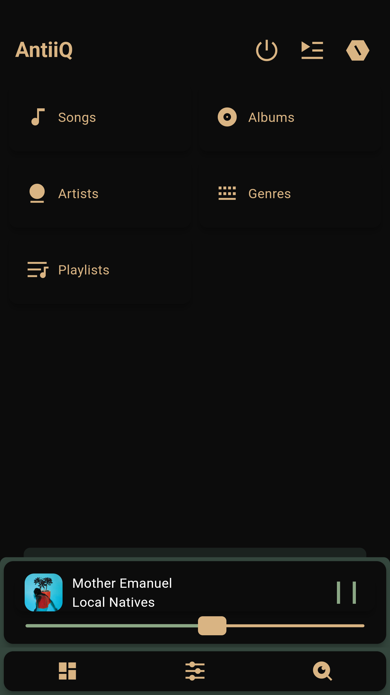
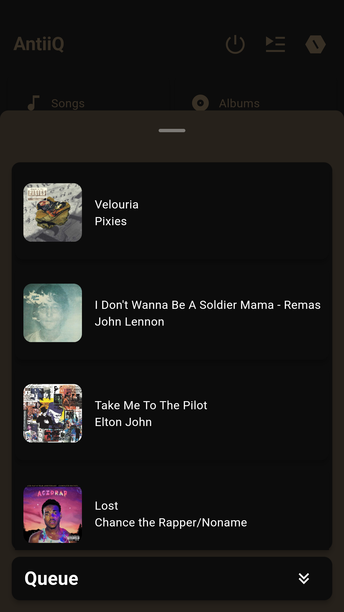
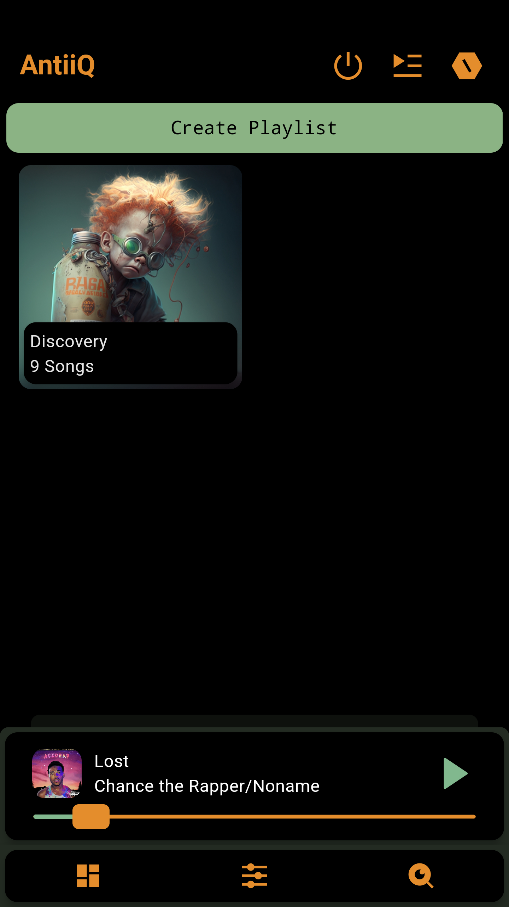
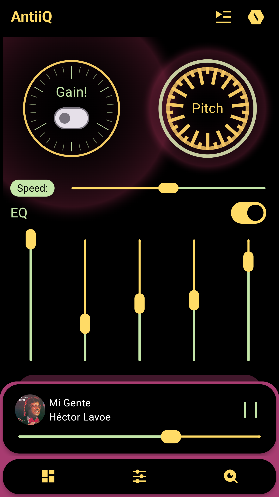
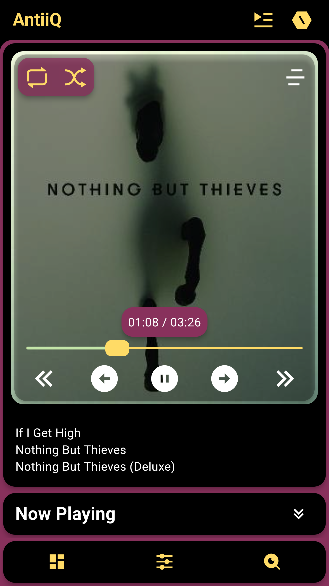
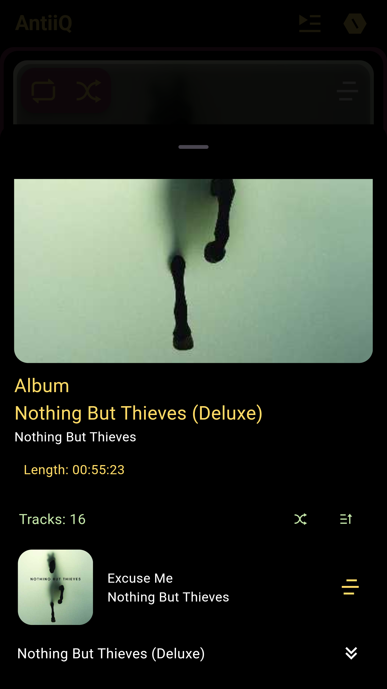
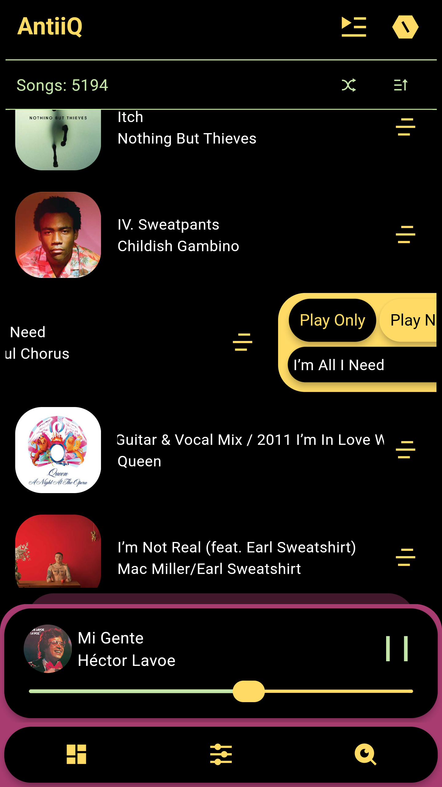

# AntiiQ

<h3 align="center">A Music Player for Music Collectors and Enthusiasts.</h3>

[Grab the latest APK from Codeberg](https://codeberg.org/coleblvck/AntiiQ/releases)

## About

AntiiQ as in "Antique" is an offline Android music player which started as a personal project due to my search for an open source music player with some specific features without finding one, so here we go.

## Screenshots

    
    
    
    
    
    
    
    

## Features

- Offline
- It plays audio
- Directory selection
- Customizable behavior
- Backup and restore user preferences and Playlists
- Equalizer
- Pitch, gain and speed tweaks
- Embedded covers support
- Search functionality
- Favourites
- Global Selection

## To-Do...?
- Additional configurations
- Landscape mode
- Add warning dialogs for actions such as "Delete Playlist"
- UI tweaking options
- Add a toggle for showing track duration on the now-playing screen
- More Themes(Probably including user theming).

## Might-Not-DO...
- Tag Editing: Attempted in a few different ways; app became quite heavy, while also leaving some pretty large footprints in cache and data storages.

Note: This player has been tested to be working fully on Android 14 & 13, also partially tested on a device running Android 10. Your mileage may vary and so, some feedback would be needed if any behaviour improvements would be necessary.