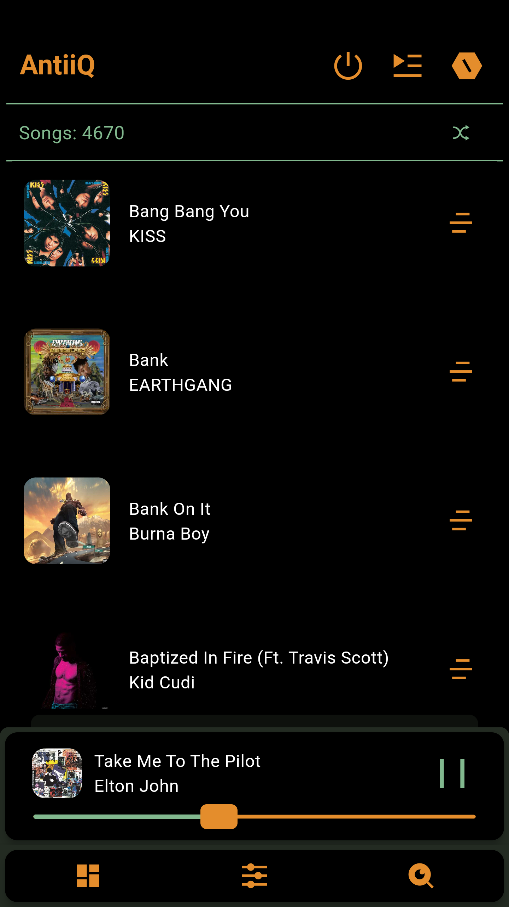
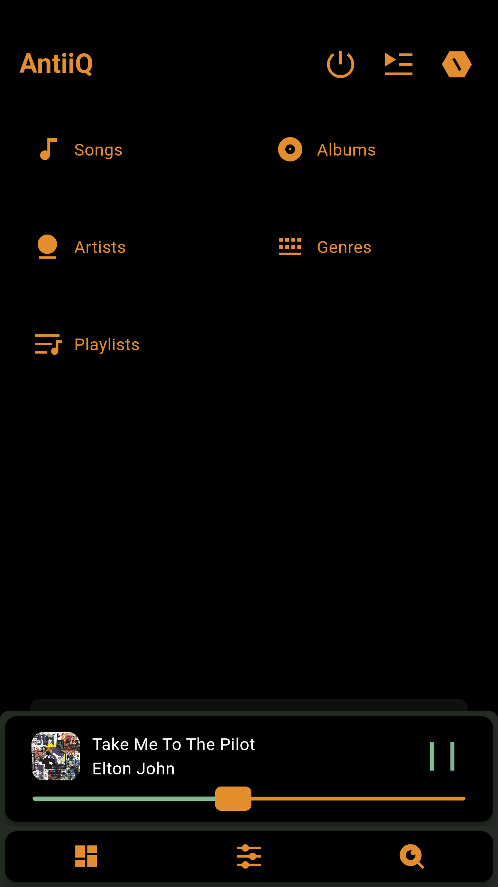

# AntiiQ

<h3 align="center">A Music Player for Music Collectors and Enthusiasts.</h3>

## About

AntiiQ is an offline Android music player which started as a personal project due to my search for an open source music player with some specific features without finding one, so here we go.

## Screenshots

    
    
    
    
    

## Features

- Offline
- It plays audio
- Directory selection
- Customizable behavior
- Backup and restore user preferences and Playlists
- Equalizer
- Pitch, gain and speed tweaks
- Embedded covers support
- Search functionality

## Todo
- Additional Sort types from the default
- Some minor UI rearrangements

Note: This player has been tested to be working fully on Android 13, and partially tested on a device running Android 10. Your mileage may vary and so, some feedback would be needed if any behaviour improvements would be necessary.