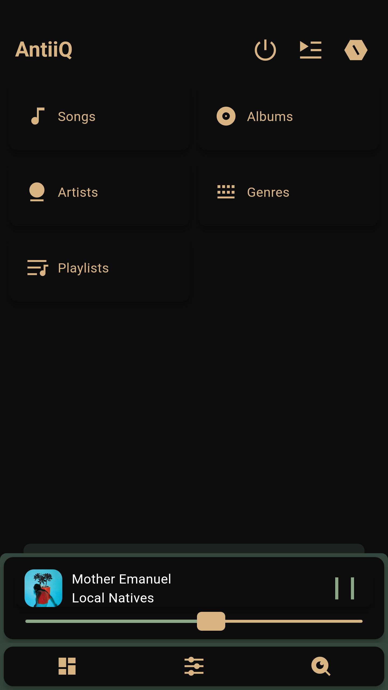
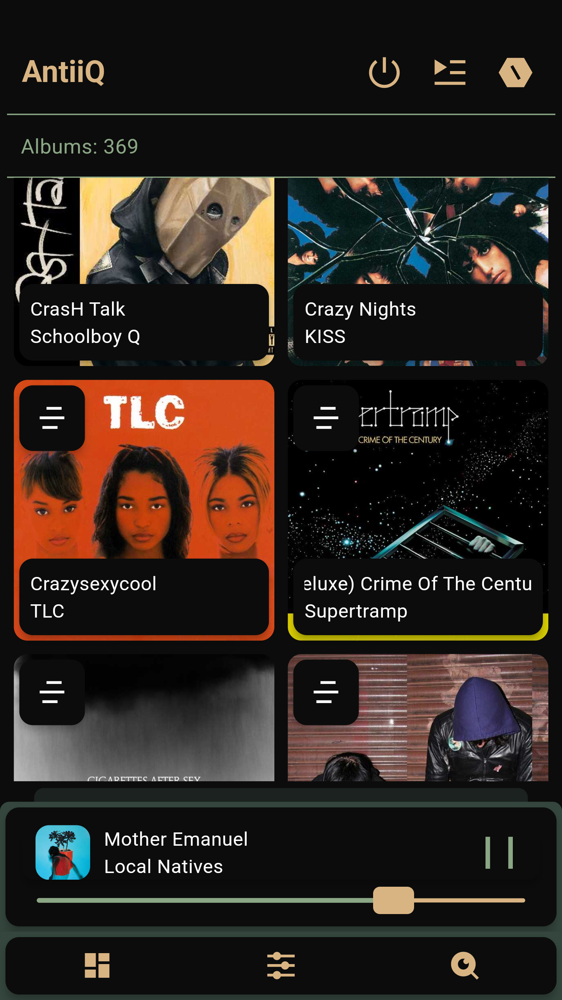
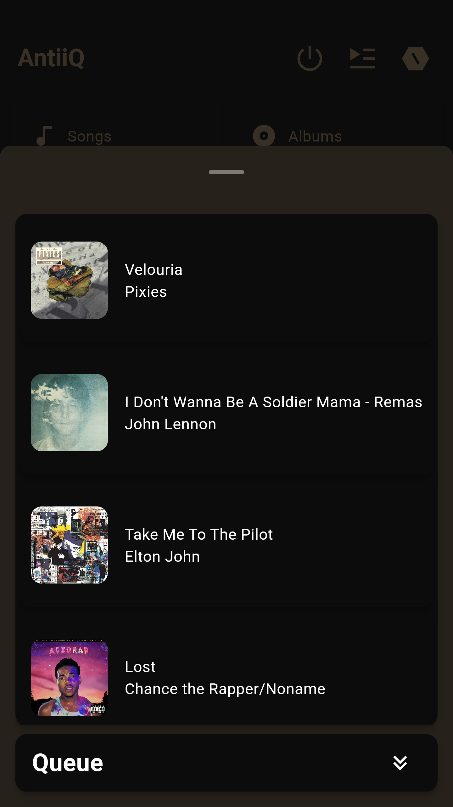
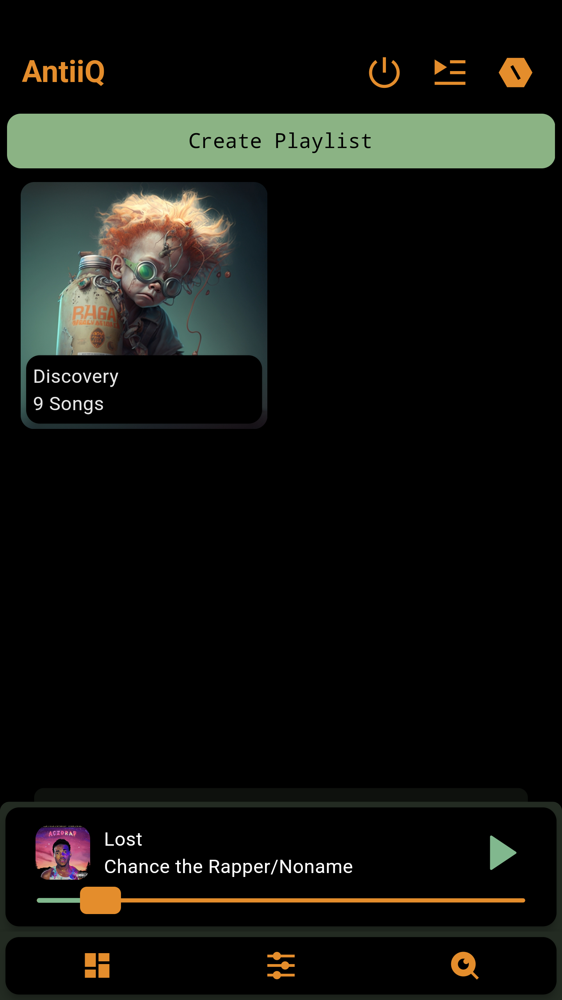
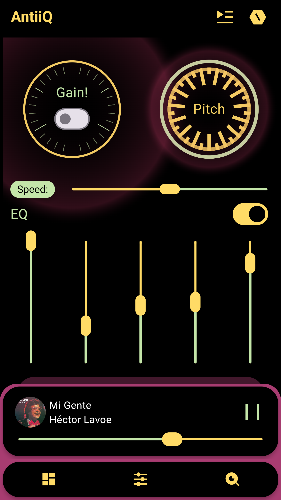
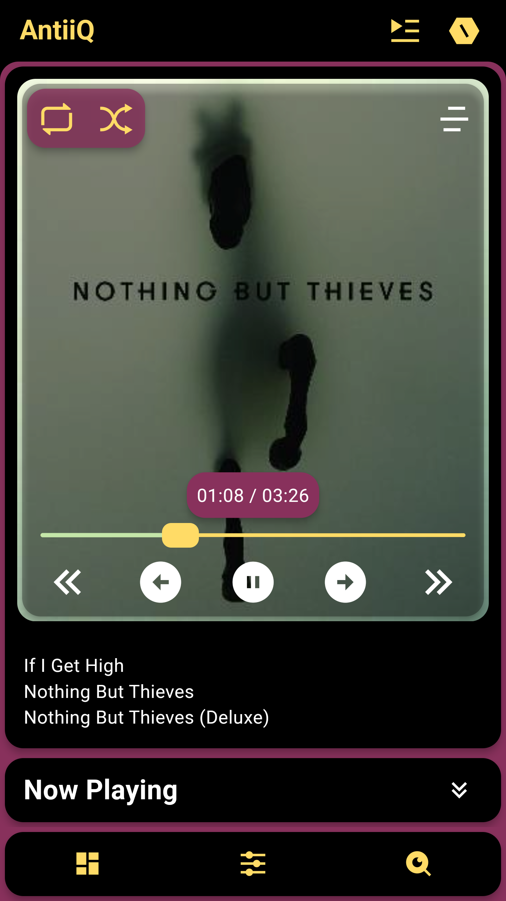
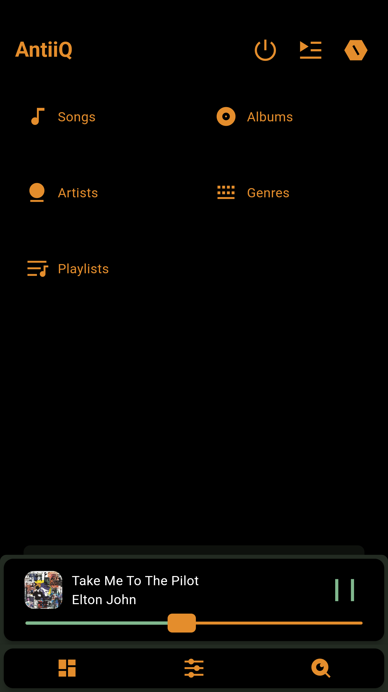
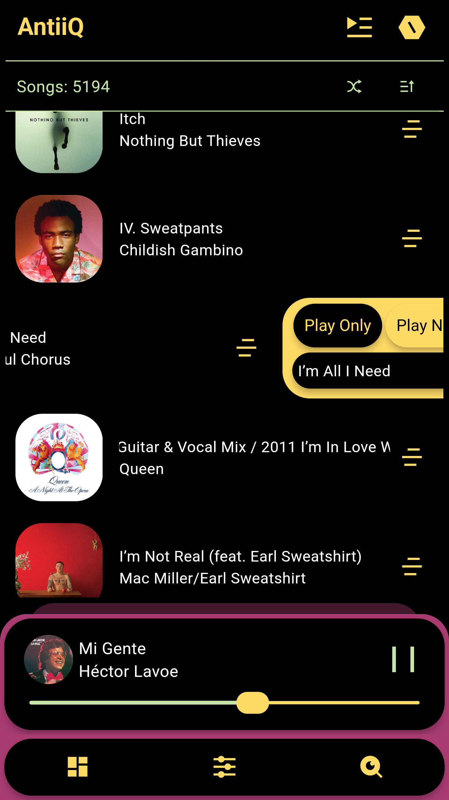

# AntiiQ

<h3 align="center">An offline music player for large local collections.</h3>

## Screenshots

    
    
    
    
    
    
    
    

## What It Does

AntiiQ is a local-first Android music player built for people who keep their music on the device. It scans storage directly, reads metadata with a native reader, and plays from your local library without network accounts or streaming services.

Version 2.0 adds a native playback path for broader format support, gapless playback, crossfade, speed and pitch control, and a 15-band parametric equalizer. The app still keeps the familiar classic interface, while Chaos UI offers a more expressive dashboard, library, queue, and settings experience.

## Features

- Offline local playback
- Native storage scanning and metadata reading
- Support for common and less common local audio formats
- Gapless playback and optional crossfade
- 15-band parametric equalizer
- Speed and pitch controls
- Embedded artwork support
- Queue management, shuffle, repeat, and endless play
- Favourites, listening history, playlists, and search
- Folder selection and library scan controls
- Backup and restore for user preferences and playlists
- Classic UI and Chaos UI
- Home screen widget and media notification controls
- Intent playback from shared or opened audio files

## AntiiQ Core

AntiiQ Core is the separate native edition from Artatura, built for deeper playback control and a more advanced engine. Learn more at [antiiq.artatura.com](https://antiiq.artatura.com).

## Credits

- [Ryan Heise](https://github.com/ryanheise) for the Flutter audio service ecosystem.
- [FFmpeg](https://ffmpeg.org/) for multimedia decoding and metadata support.
- [SoundTouch](https://www.surina.net/soundtouch/) for tempo and pitch processing.
- The open-source Flutter and Android communities.

## Feedback

Suggestions, bug reports, and release feedback are welcome.
